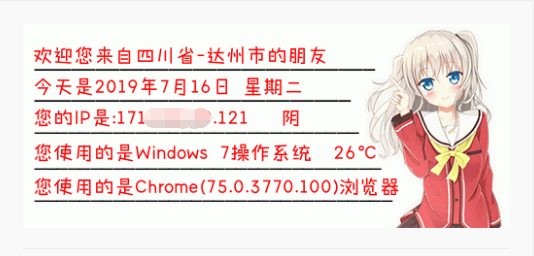

# IP 签名档 · Cloudflare Workers 版

基于 Cloudflare Workers 的动态 IP 签名档服务，展示访问者的 IP 地址、地理位置、日期、天气、操作系统和浏览器信息。带有看板娘和温暖背景的精美 SVG 签名档，无需服务器，全球边缘网络加速，零运维。

## 功能特性

- **IP 地址** — 通过 Cloudflare 边缘网络获取真实访客 IP（完整展示）
- **地理位置** — 使用 Cloudflare 内置 `request.cf` 数据，无需第三方 IP 库
- **日期星期** — 自动显示当前日期和星期
- **天气信息** — 基于 [Open-Meteo](https://open-meteo.com/) 免费 API，无需密钥
- **操作系统识别** — 支持 Windows / macOS / iOS / Android / Linux / HarmonyOS
- **浏览器识别** — 支持 Chrome / Firefox / Safari / Edge / Opera / 微信 / QQ 等
- **SVG 签名档** — 矢量格式，534×256 分辨率，带看板娘插画和动态下划线
- **JSON API** — 提供结构化数据接口，方便二次开发

## 签名档效果

<p align="center">
  
</p>

<p align="center">
  <em>静态预览图（上）· 已部署服务的动态签名档（下，实时变化，JPEG 格式，兼容 GitHub camo 代理）</em>
</p>

<p align="center">
  
</p>

部署后将下方链接替换为你的域名，即可在 GitHub README 中展示动态签名档（推荐使用 `/preview.jpg`，兼容性最好）：

```markdown

```

> **说明**：
> - 推荐用 `/preview.jpg` 渲染成 JPEG 位图，GitHub camo 代理对 JPEG 兼容性最好，几乎不会渲染失败
> - 如需无损 PNG 或透明背景，可使用 `/preview.png` 端点
> - 如果希望纯矢量可缩放，可使用原 `/svg` 端点，但 GitHub 或部分论坛可能会因 SVG 内的字体/图片引用导致渲染异常
> - GitHub 通过 camo 代理缓存图片，首次加载或更新可能有数分钟延迟，可点击仓库 **Commit changes...** 触发重新渲染
> - 每位访客看到的 IP / 地区 / 浏览器等信息会根据其自身网络环境动态变化

签名档包含以下元素：
- 📍 访问者地区信息
- 📅 日期和星期
- 🌐 完整 IP 地址 + 天气
- 💻 操作系统信息
- 🖥️ 浏览器信息
- 👧 右侧看板娘插画
- 🎨 温暖面包店背景 + 动态长度下划线

## 项目结构

```
ip-info/
├── .github/
│   └── workflows/
│       └── deploy.yml        # GitHub Actions 自动部署
├── public/
│   ├── msyh.ttf             # 微软雅黑字体（静态资源）
│   ├── kbn.png               # 看板娘图片
│   └── bg.jpg                # 背景图片
├── src/
│   ├── index.js              # Worker 入口，路由与请求处理
│   ├── generator.js          # 信息采集与 SVG / HTML 生成
│   ├── ua-parser.js          # User-Agent 解析（操作系统 + 浏览器）
│   └── weather.js            # 天气获取（Open-Meteo API）
├── wrangler.jsonc            # Wrangler 配置
├── package.json              # 项目依赖与脚本
└── .gitignore
```

## 快速开始

### 前置要求

- Node.js 22+
- npm 10+

### 安装与本地开发

```bash
npm install
npm run dev
```

本地服务启动后访问 `http://localhost:8787` 即可查看效果。

### 部署到 Cloudflare

```bash
# 首次使用需登录
npx wrangler login

# 部署到全球边缘网络
npm run deploy
```

部署成功后会得到一个 `https://ip-info.<你的子域>.workers.dev` 的地址。

### 自动部署（GitHub Actions）

项目已配置 GitHub Actions 自动部署工作流。推送到 `main` 或 `master` 分支时自动触发部署。

**配置步骤：**

1. 在 GitHub 仓库中进入 **Settings → Secrets and variables → Actions**
2. 添加 Repository secret：
   - Name: `CLOUDFLARE_API_TOKEN`
   - Value: 你的 Cloudflare API Token

**获取 API Token：**

1. 登录 [Cloudflare Dashboard](https://dash.cloudflare.com/profile/api-tokens)
2. 点击 **Create Token**
3. 使用 **Edit Cloudflare Workers** 模板
4. 复制生成的 Token（仅显示一次）

配置完成后，每次推送代码将自动部署到 Cloudflare Workers。

## 使用方法

### 端点说明

| 端点                  | 说明                        |
| ------------------- | ------------------------- |
| `GET /`             | 完整 HTML 页面，展示所有信息 + 签名档预览 |
| `GET /svg`          | SVG 签名档图片，可直接用 `` 引用 |
| `GET /svg?s=自定义文字` | 带自定义文字的签名档                |
| `GET /api/info`     | JSON 接口，返回所有结构化数据         |
| `GET /health`       | 健康检查                      |

### 在论坛 / 博客中引用签名档

将下面的 `<你的子域>` 替换为你实际部署得到的子域，或替换为自定义域名（如 `ip-info.mooncc.cc`）。

#### 🌐 HTML（网站 / 博客 / 支持 HTML 的论坛）

基础签名档：

```html
.workers.dev/svg" alt="IP签名档" />
```

带自定义文字（可选）：

```html
.workers.dev/svg?s=欢迎光临" alt="IP签名档" />
```

#### 📋 Markdown（GitHub / README / 支持 Markdown 的平台）

基础签名档：

```markdown

```

带自定义文字（可选）：

```markdown

```

#### 🏷️ BBCode / UBB（传统论坛如 Discuz!、phpBB 等）

基础签名档：

```bbcode
[img]https://ip-info.<你的子域>.workers.dev/svg[/img]
```

带自定义文字（可选）：

```bbcode
[img]https://ip-info.<你的子域>.workers.dev/svg?s=欢迎光临[/img]
```

#### 🔗 直接链接（复制粘贴即可）

基础签名档：

```
https://ip-info.<你的子域>.workers.dev/svg
```

带自定义文字（可选）：

```
https://ip-info.<你的子域>.workers.dev/svg?s=欢迎光临
```

### JSON API 示例

```bash
curl https://ip-info.<你的子域>.workers.dev/api/info
```

```json
{
  "ip": "203.0.113.42",
  "location": "CN-Sichuan-Dazhou",
  "country": "CN",
  "region": "Sichuan",
  "city": "Dazhou",
  "os": "Windows 10/11",
  "browser": "Chrome(120.0.0.0)",
  "dateStr": "2026年8月6日",
  "weekStr": "星期四",
  "weather": {
    "temperature": 32,
    "description": "晴",
    "text": "晴 32℃"
  },
  "timestamp": "2026-08-06T08:41:54.970Z"
}
```

## 技术栈

| 组件        | 技术                           |
| --------- | ---------------------------- |
| 运行时       | Cloudflare Workers           |
| 图片格式      | SVG（矢量，支持中文字体）               |
| IP / 地理定位 | Cloudflare `request.cf` 内置数据 |
| 天气数据      | Open-Meteo 免费 API            |
| UA 解析     | 自研轻量正则解析器                    |
| 配置        | Wrangler + `wrangler.jsonc`  |
| 静态资源      | Workers Static Assets（字体 / 图片）   |
| 自动部署      | GitHub Actions               |

## License

MIT
