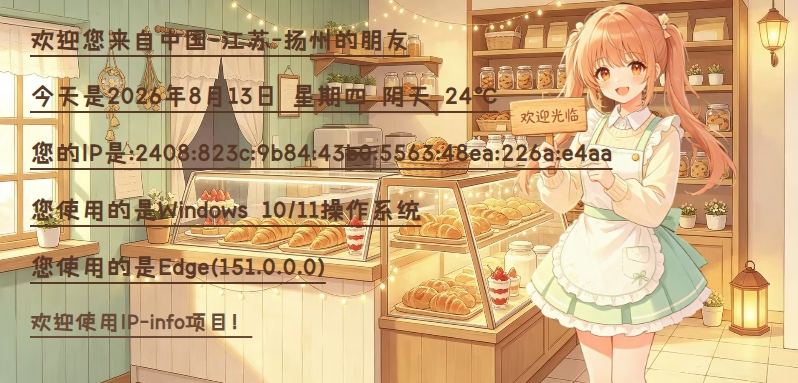

# IP 签名档 · Cloudflare Workers 版

基于 Cloudflare Workers 的动态 IP 签名档服务，展示访问者的 IP 地址、地理位置、日期、天气、操作系统和浏览器信息。带有看板娘和温暖背景的精美签名档（SVG 矢量 + PNG 位图），无需服务器，全球边缘网络加速，零运维。

## 功能特性

- **IP 地址** — 通过 Cloudflare 边缘网络获取真实访客 IP（完整展示）
- **地理位置** — 使用 Cloudflare 内置 `request.cf` 数据，无需第三方 IP 库
- **日期星期** — 自动显示当前日期和星期
- **天气信息** — 基于 [Open-Meteo](https://open-meteo.com/) 免费 API，无需密钥
- **操作系统识别** — 支持 Windows / macOS / iOS / Android / Linux / HarmonyOS
- **浏览器识别** — 支持 Chrome / Firefox / Safari / Edge / Opera / 微信 / QQ 等
- **签名档图片** — 提供 SVG 矢量与 PNG 位图两种格式（534×256），带看板娘插画和动态长度下划线
- **隐私保护** — 智能识别 GitHub Camo 等图片代理请求，代理访问时返回提示图而非泄露代理服务器信息
- **JSON API** — 提供结构化数据接口，方便二次开发

## 签名档效果

<p align="center">
  
</p>

<p align="center">
  <em>静态预览图（上）· 动态签名档示例（下）</em>
</p>

<p align="center">
  
</p>

部署后将下方链接替换为你的域名，即可在 GitHub README 中展示签名档（推荐使用 `/jpg`，兼容性最好）：

```markdown

```

> **说明**：
> - **关于 GitHub README 中的显示**：由于 GitHub 使用 Camo 代理机制，在 README 中嵌入的图片会被 GitHub 的代理服务器转发，导致无法获取访客的真实 IP 和浏览器信息。为保护隐私，服务检测到代理请求时会返回一张提示图（如上方所示），引导访客访问主页查看真实信息。
> - 推荐用 `/jpg` 端点（输出 PNG 位图），对位图兼容性最好，几乎不会渲染失败；`/png` 与其等价
> - 如需纯矢量可缩放，可使用 `/svg` 端点
> - GitHub 通过 camo 代理缓存图片，首次加载或更新可能有数分钟延迟，可点击仓库 **Commit changes...** 触发重新渲染
> - 每位访客看到的 IP / 地区 / 浏览器等信息会根据其自身网络环境动态变化
> - 👉 **点击查看你的真实信息**：[https://ip-info.mooncc.cn](https://ip-info.mooncc.cn)

签名档包含以下元素：
- 📍 访问者地区信息
- 📅 日期和星期
- 🌐 完整 IP 地址 + 天气
- 💻 操作系统信息
- 🖥️ 浏览器信息
- 👧 右侧看板娘插画
- 🎨 温暖面包店背景 + 动态长度下划线

## 项目结构

```
ip-info/
├── .github/
│   └── workflows/
│       └── deploy.yml        # GitHub Actions 自动部署
├── public/
│   ├── msyh.ttf             # 微软雅黑字体（静态资源）
│   ├── kbn.png               # 看板娘图片
│   ├── bg.jpg                # 背景图片
│   ├── card_bg.rgba          # 构建产物：预渲染背景（gitignored）
│   ├── font_atlas.rgba       # 构建产物：GB2312 字形图集（gitignored）
│   └── font_atlas.json       # 构建产物：字形布局元数据（gitignored）
├── scripts/
│   ├── generate_modules.js   # 将小资源打包为 Data 模块
│   └── prerender.js          # 预渲染背景 + 字形图集（@napi-rs/canvas）
├── src/
│   ├── index.js              # Worker 入口，路由 + 代理检测 + 隐私保护
│   ├── generator.js          # 信息采集与 SVG / HTML 生成
│   ├── bitmap-renderer.js    # 纯 JS 位图渲染器（背景合成 + 字形 blit）
│   ├── png-encoder.js        # 纯 JS PNG 编码器（CompressionStream）
│   ├── image.js              # 静态资源加载（Data 模块 + ASSETS binding）
│   ├── ua-parser.js          # User-Agent 解析（操作系统 + 浏览器）
│   ├── weather.js            # 天气获取（Open-Meteo API）
│   └── _assets/              # 构建产物：小资源 Data 模块（gitignored）
├── wrangler.jsonc            # Wrangler 配置
├── package.json              # 项目依赖与脚本
└── .gitignore
```

## 快速开始

### 前置要求

- Node.js 22+
- npm 10+

### 安装与本地开发

```bash
npm install
npm run dev
```

`npm run dev` 会通过 `predev` 钩子自动执行预渲染（`scripts/prerender.js`），生成 `public/card_bg.rgba`、`public/font_atlas.rgba`、`public/font_atlas.json` 三个构建产物（已加入 `.gitignore`，本地与 CI 均在部署前自动生成）。

本地服务启动后访问 `http://localhost:8787` 即可查看效果。

### 部署到 Cloudflare

```bash
# 首次使用需登录
npx wrangler login

# 部署到全球边缘网络（predeploy 钩子会自动预渲染背景与字形图集）
npm run deploy
```

部署成功后会得到一个 `https://ip-info.<你的子域>.workers.dev` 的地址。

> **关于 `/jpg` 输出 PNG**：纯 JS JPEG 编码无法在 Workers 免费版 10ms CPU 限制内完成，故 `/jpg` 与 `/png` 端点统一输出 PNG 位图（`Content-Type: image/png`）。camo 代理与 `` 按 `Content-Type` 渲染，README 兼容性不受影响；URL 仍为 `/jpg`，前端默认格式不变。

### 自动部署（GitHub Actions）

项目已配置 GitHub Actions 自动部署工作流。推送到 `main` 或 `master` 分支时自动触发部署。

**配置步骤：**

1. 在 GitHub 仓库中进入 **Settings → Secrets and variables → Actions**
2. 添加 Repository secret：
   - Name: `CLOUDFLARE_API_TOKEN`
   - Value: 你的 Cloudflare API Token

**获取 API Token：**

1. 登录 [Cloudflare Dashboard](https://dash.cloudflare.com/profile/api-tokens)
2. 点击 **Create Token**
3. 使用 **Edit Cloudflare Workers** 模板
4. 复制生成的 Token（仅显示一次）

配置完成后，每次推送代码将自动部署到 Cloudflare Workers。

## 使用方法

### 端点说明

| 端点                  | 说明                            |
| ------------------- | ----------------------------- |
| `GET /`             | 完整 HTML 页面，展示所有信息 + 签名档预览     |
| `GET /jpg`          | PNG 位图签名档，GitHub README 推荐    |
| `GET /png`          | PNG 位图签名档（与 `/jpg` 等价）        |
| `GET /svg`          | SVG 矢量签名档，可直接用 `` 引用     |
| `GET /jpg?s=自定义文字` | 带自定义文字的位图签名档                 |
| `GET /svg?s=自定义文字` | 带自定义文字的矢量签名档                 |
| `GET /preview.jpg`  | `/jpg` 旧兼容路径                  |
| `GET /preview.png`  | `/png` 旧兼容路径                  |
| `GET /api/info`     | JSON 接口，返回所有结构化数据            |
| `GET /health`       | 健康检查                          |

### 在论坛 / 博客中引用签名档

将下面的 `<你的子域>` 替换为你实际部署得到的子域，或替换为自定义域名（如 `ip-info.mooncc.cc`）。

#### 🌐 HTML（网站 / 博客 / 支持 HTML 的论坛）

基础签名档：

```html
.workers.dev/jpg" alt="IP签名档" />
```

带自定义文字（可选）：

```html
.workers.dev/jpg?s=欢迎光临" alt="IP签名档" />
```

#### 📋 Markdown（GitHub / README / 支持 Markdown 的平台）

基础签名档：

```markdown

```

带自定义文字（可选）：

```markdown

```

#### 🏷️ BBCode / UBB（传统论坛如 Discuz!、phpBB 等）

基础签名档：

```bbcode
[img]https://ip-info.<你的子域>.workers.dev/jpg[/img]
```

带自定义文字（可选）：

```bbcode
[img]https://ip-info.<你的子域>.workers.dev/jpg?s=欢迎光临[/img]
```

#### 🔗 直接链接（复制粘贴即可）

基础签名档：

```
https://ip-info.<你的子域>.workers.dev/jpg
```

带自定义文字（可选）：

```
https://ip-info.<你的子域>.workers.dev/jpg?s=欢迎光临
```

### JSON API 示例

```bash
curl https://ip-info.<你的子域>.workers.dev/api/info
```

```json
{
  "ip": "203.0.113.42",
  "location": "CN-Sichuan-Dazhou",
  "country": "CN",
  "region": "Sichuan",
  "city": "Dazhou",
  "os": "Windows 10/11",
  "browser": "Chrome(120.0.0.0)",
  "dateStr": "2026年8月14日",
  "weekStr": "星期四",
  "weather": {
    "temperature": 32,
    "description": "晴",
    "text": "晴 32℃"
  },
  "timestamp": "2026-08-14T08:41:54.970Z"
}
```

## 技术栈

| 组件        | 技术                           |
| --------- | ---------------------------- |
| 运行时       | Cloudflare Workers（免费版 10ms CPU）|
| 图片格式      | SVG 矢量 + PNG 位图（纯 JS 渲染）    |
| 位图渲染      | 构建时预渲染背景 + GB2312 字形图集，运行时纯 JS 合成 + `CompressionStream` PNG 编码 |
| IP / 地理定位 | Cloudflare `request.cf` 内置数据 |
| 天气数据      | Open-Meteo 免费 API            |
| UA 解析     | 自研轻量正则解析器                    |
| 配置        | Wrangler + `wrangler.jsonc`  |
| 静态资源      | Workers Static Assets（字体 / 图片 / 预渲染位图）|
| 自动部署      | GitHub Actions               |

## 隐私保护机制

当您在 GitHub README、论坛等第三方平台嵌入签名档时，这些平台通常会使用 **图片代理**（如 GitHub Camo）转发图片请求。这会导致 Worker 收到的请求来自代理服务器而非您本人的浏览器，从而显示错误的 IP 和浏览器信息。

为保护您的隐私，服务实现了智能代理检测：

1.  **检测逻辑**：Worker 检查请求的 `User-Agent` 和 `Referer` 头，识别常见的代理/机器人特征（如 `Camo`、`curl`、`python-requests`、`Googlebot` 等）。
2.  **隐私保护**：检测到代理请求时，Worker 返回一张友好的提示图，内容为“🔒 该图片由第三方代理转发，已隐藏真实 IP 和浏览器信息。👉 点击访问主页查看真实信息”。
3.  **正常请求不受影响**：直接访问 `/jpg`、`/png` 或 `/svg` 端点的真实用户，仍会看到完整的动态签名档。

这种设计确保了在第三方平台嵌入签名档时不会泄露访客的真实网络信息，同时提供了清晰的引导，让感兴趣的用户可以点击链接查看自己的真实 IP 和浏览器详情。

## License

MIT
